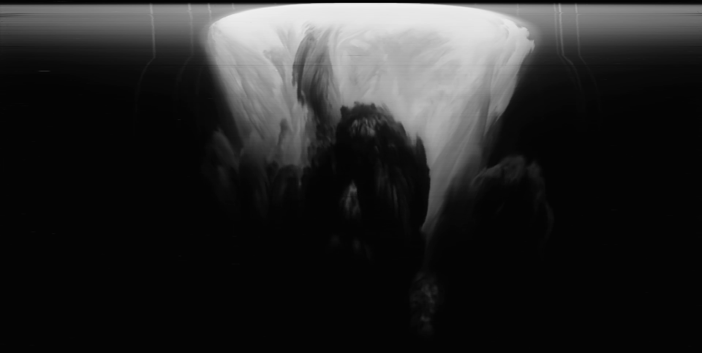

# Nuke Scan

Scripts used for [Nuke Scan][post]


## Installation
The script is written python3 and depends on Pillow. To install:

```
pip install -r requirements.txt
```

The script also uses ffmpeg to extract frames from the input video. 

## Usage
To create a slice from fames of an input video

```bash
$ python main.py "redwing-apache37257.mp4" --out out.png 
```

The default samples a column of pixels at the center of the video. To sample a different column in the video, use the `--location`:

```bash
python main.py "redwing-apache37257.mp4" --out out.png --location 0.3
```

`location` is percent location to sample from. For a video that is 1920 pixels wide for example, `--location 0.3` will sample from the `1920 * 0.3 = 640` column of pixels in each frame.

To sample from just part of a video, use pass ffmpeg timestamps to `--start` and `--end`:

```bash
$ python main.py "redwing-apache37257.mp4" --start 00:00:08.4 --end 00:01:16.6 --out out.png
```

**All Arguments**

* `--out outFile.png` — Name of output image.
* `--location 0.5` — Percent location to sample from. Number between 0 and 1
* `--start 00:00:00` — Timestamp to start sampling video at.
* `--end 00:01:00` — Timestamp to end sampling video at.
* `--end 00:01:00` — Timestamp to end sampling video at.
* `--flipSample` — Sample rows instead of columns.
* `--sampleSize 10` — Width of pixels to grab from each column or row
* `--skipExtract` — Skips the frame extract stage and reuse the existing cache of frames. 

[post]: https://blog.mattbierner.com/nuke-scan